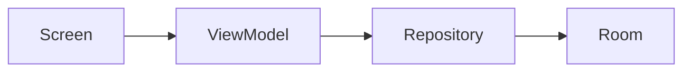

# Documentation Standards v1.0

**Fecha:** 15 de agosto de 2026  
**Versión:** 1.0  
**Estado:** Activo  
**Propósito:** Estándar oficial de escritura para toda la documentación de Xpendz.

---

## 1. Documentation Philosophy

La documentación de Xpendz debe preservar conocimiento arquitectónico, no describir código línea por línea. Cada documento debe responder:

- ¿Qué es esto?
- ¿Por qué existe?
- ¿Cómo funciona?
- ¿Cómo se relaciona con el resto del sistema?
- ¿Qué decisiones arquitectónicas lo sostienen?
- ¿Qué riesgos y deuda técnica conlleva?

Un nuevo desarrollador debe poder entender el sistema leyendo documentación antes de abrir el código.

## 2. Naming Conventions

### Archivos
- Usar **Title Case** con espacios: `Master Architecture v1.0.md`
- Incluir versión en documentos estables: `v1.0`, `v2.0`
- ADRs: `ADR-NNN Title.md`
- Templates: `Template - Title.md`
- Evitar caracteres especiales distintos de espacios y guiones.

### Títulos
- Encabezado principal `#` con nombre del documento.
- Subtítulos con fechas, versión y estado.
- Evitar Javadoc: no documentar métodos, documentar sistemas.

## 3. Folder Organization

```
docs/
├── 00_Project/         # Visión, estándares, glosario, onboarding
├── 01_Audits/          # Auditorías técnicas
├── 02_DesignSystem/    # Sistema de diseño y tokens
├── 03_Architecture/    # Arquitectura y módulos
├── 04_Decisions/       # Architecture Decision Records
├── 05_Roadmaps/        # Roadmaps y planes
├── 06_Sprints/         # Reportes de sprints
├── 07_Quality/         # Calidad, mantenimiento, QA
├── 08_Knowledge/       # Conocimiento de producto y arquitectura
├── 09_History/         # Evolución arquitectónica
├── Templates/          # Plantillas reutilizables
├── branding/           # Guías de marca
├── legal/              # Legal
├── play-store/         # Play Store
├── premium/            # Monetización
├── release/            # Lanzamiento
└── README.md           # Índice maestro
```

## 4. Markdown Conventions

- Encabezados con `#` en niveles jerárquicos (máximo `###`).
- Tablas para listas comparativas y matrices.
- Listas con viñetas para items cortos.
- Bloques de código con lenguaje específico (`kotlin`, `mermaid`, `json`).
- Saltos de línea consistentes; no más de una línea en blanco consecutiva.
- Negritas para términos importantes, no subrayados.

## 5. Mermaid Conventions

- Usar Mermaid cuando comunica una idea mejor que el texto.
- Preferir `flowchart`, `sequenceDiagram` y `erDiagram`.
- Evitar diagramas para código trivial.
- Cada diagrama debe estar cerca de la explicación que lo contextualiza.
- Comentar o describir el diagrama en párrafo adyacente.

Ejemplo:



## 6. Cross-Reference Conventions

- Cada documento debe incluir sección `## Related Documents`.
- Usar rutas relativas con espacios URL-encodeados:
  - `[Master Architecture](03_Architecture/Master%20Architecture%20v1.0.md)`
- Referenciar ADRs cuando se menciona una decisión arquitectónica.
- Referenciar módulos cuando se habla de interacciones.

## 7. ADR Creation Rules

Cada ADR debe incluir:
1. Fecha, estado y decisores.
2. Contexto.
3. Decisión.
4. Consecuencias positivas y negativas.
5. Alternativas consideradas.

Estados posibles: `Proposed`, `Aceptado`, `Deprecated`, `Superseded`.
Cuando un ADR reemplaza a otro, referenciar el anterior.

## 8. Technical Debt Documentation Rules

- Documentar deuda técnica como observación, no como plan de refactor.
- Clasificar: arquitectónica, de código, de tests, de documentación.
- Evaluar impacto: `Bajo`, `Medio`, `Alto`.
- Proporcionar justificación de por qué existe, no solo qué es.
- No incluir soluciones a menos que sean recomendaciones futuras explícitas.

## 9. Architectural Inference Rules

- Cuando la razón no está explícita en el código, inferirla y marcarla como:
  - **"Inferencia arquitectónica"**
- Nunca presentar inferencias como hechos.
- Explicar la base de la inferencia (patrón observado, contexto del proyecto, restricciones).

## 10. Future Improvements Rules

- Cada documento de módulo debe incluir mejoras futuras.
- Items concretos, no aspiraciones vagas.
- Priorizar por impacto y esfuerzo cuando sea posible.
- Distinguir entre: mejora, refactor, nueva feature, deuda técnica.

## 11. Module Health Rules

Todo documento de módulo debe incluir al final una sección `Module Health` con:

| Campo | Descripción |
|-------|-------------|
| **Architecture Quality** | Qué tan bien sigue los patrones del proyecto |
| **Documentation Quality** | Qué tan completa está la documentación del módulo |
| **Complexity** | Nivel de complejidad inherente |
| **Technical Debt** | Deuda técnica identificada |
| **Risk Level** | Riesgo de cambiar el módulo |
| **Refactor Recommended** | ¿Se recomienda refactorización? |
| **Last Reviewed** | Última revisión |
| **Next Review** | Próxima revisión sugerida |

## 12. Review Checklist

Antes de dar por finalizado un documento:

- [ ] ¿Explica qué es el tema?
- [ ] ¿Explica por qué existe?
- [ ] ¿Explica cómo funciona?
- [ ] ¿Incluye diagramas cuando mejora la comprensión?
- [ ] ¿Lista dependencias entrantes y salientes?
- [ ] ¿Identifica riesgos?
- [ ] ¿Identifica deuda técnica?
- [ ] ¿Incluye mejoras futuras?
- [ ] ¿Referencia documentos relacionados?
- [ ] ¿Usa terminología del glosario?
- [ ] ¿Está libre de duplicados?
- [ ] ¿Tiene fecha, versión y estado?
