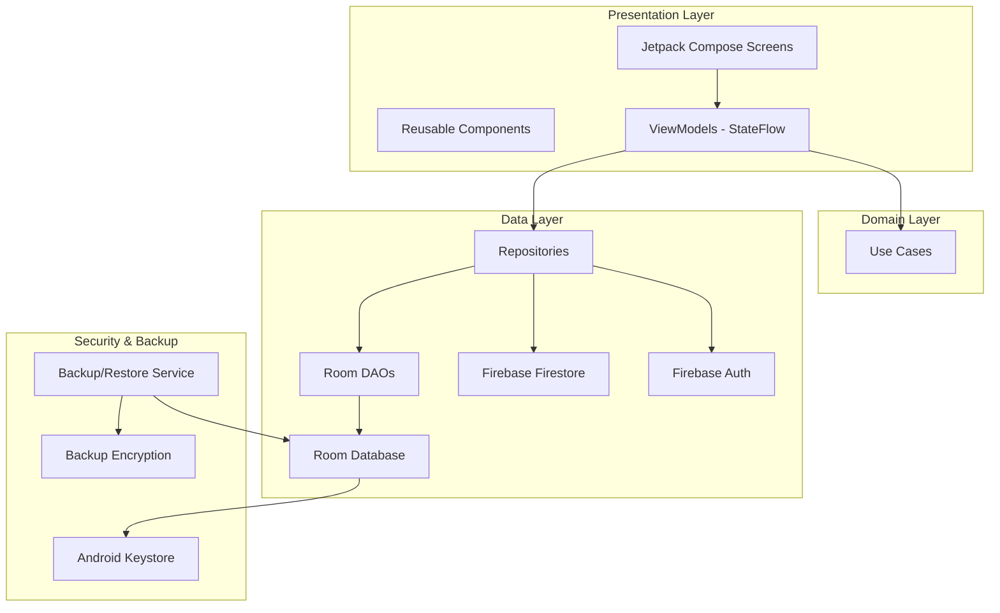
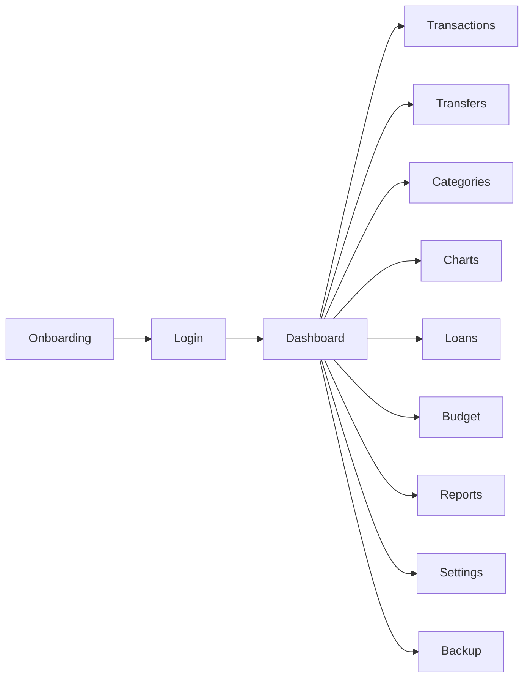
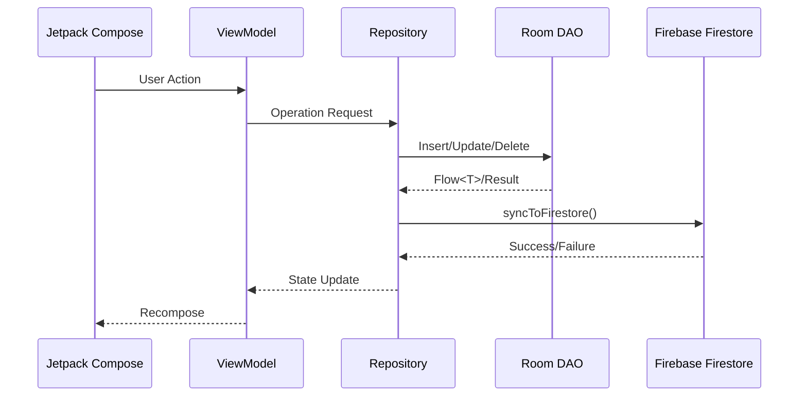
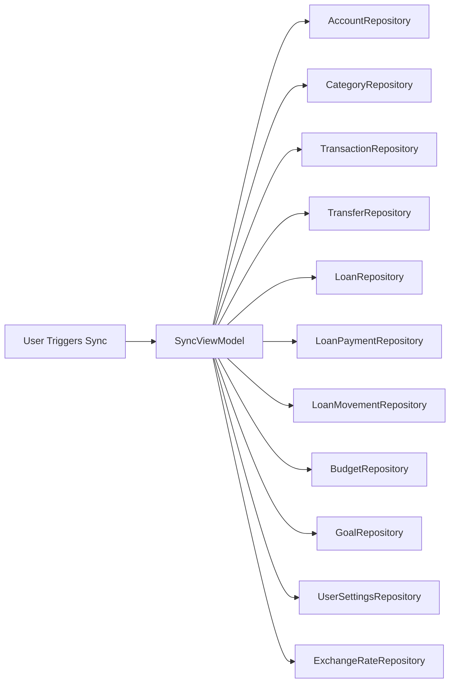
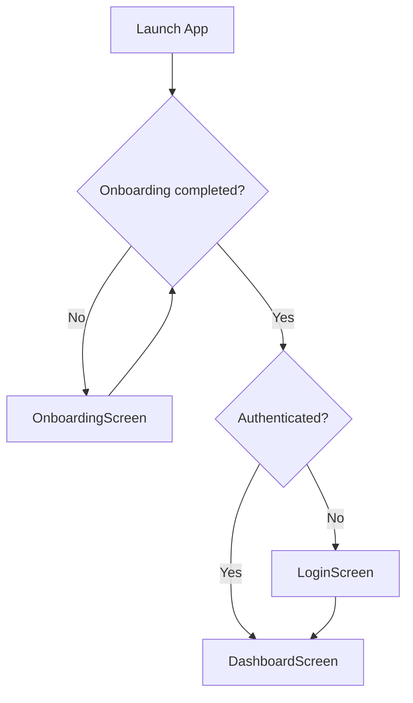
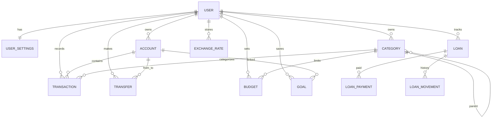

# Xpendz Master Architecture v1.0

**Fecha:** 15 de agosto de 2026  
**Versión:** 1.0  
**Estado:** Activo  
**Propósito:** Documento arquitectónico maestro del proyecto Xpendz Android.

---

## 1. Project Overview

Xpendz es una aplicación Android de finanzas personales que permite a los usuarios gestionar cuentas, transacciones, transferencias, presupuestos, metas de ahorro, préstamos y visualizar análisis financieros.

El sistema está diseñado con un enfoque **offline-first**: la aplicación funciona completamente sin conexión, sincronizando datos con Firebase Firestore cuando la conectividad lo permite. Todos los datos sensibles se almacenan cifrados localmente, y los respaldos exportados utilizan cifrado basado en contraseña.

## 2. Design Philosophy

- **Local-first:** El usuario es dueño de sus datos. El dispositivo es la fuente de verdad local.
- **Cloud sync, no cloud dependency:** Firebase es un respaldo y mecanismo de sincronización entre dispositivos, no un requisito para operar.
- **Security by default:** Datos financieros en reposo cifrados con Android Keystore; respaldos con PBKDF2 + AES-GCM.
- **Consistency over novelty:** Jetpack Compose + Material3 + Design Token System para una UI coherente.
- **Single source of truth:** Estados manejados por ViewModels con StateFlow; datos manejados por Repositories y Room.

## 3. Architectural Principles

| Principio | Aplicación |
|-----------|------------|
| **Unidirectional Data Flow** | UI → ViewModel → Repository → DAO/Firestore → UI via Flow/StateFlow |
| **Separation of Concerns** | UI, ViewModel, Repository, Data y DI claramente separados |
| **Reactive Architecture** | Coroutines + Flow para observación de datos |
| **Dependency Inversion** | Hilt provee abstracciones concretas a capas superiores |
| **Offline-First** | Room es la fuente de verdad local; Firestore es sincronización |
| **Defensive Security** | Cifrado en múltiples capas: Keystore local, PBKDF2 para backups |

## 4. High-Level Architecture



## 5. Package Organization

```
com.jcadenas.xpendz/
├── MainActivity.kt
├── XpendzApp.kt
├── core/
│   └── security/           # Cifrado, Keystore, backup crypto
├── data/
│   ├── backup/             # Export/import de respaldos
│   ├── local/              # Room: DAOs, entities, AppDatabase
│   └── repository/         # Repositorios: Room + Firestore
├── di/                     # Hilt modules
├── domain/
│   └── usecase/            # Casos de uso complejos
├── sync/                   # Device ID para multi-device
└── ui/
    ├── backup/             # UI de backup
    ├── components/         # Componentes reutilizables
    ├── model/              # UI models
    ├── navigation/         # NavHost y rutas
    ├── pdf/                # Generadores de PDF
    ├── screens/            # Pantallas por feature
    └── viewmodel/          # ViewModels
```

## 6. Module Responsibilities

| Módulo | Responsabilidad |
|--------|-----------------|
| `core.security` | Cifrado de datos locales y de respaldos |
| `data.local` | Persistencia local con Room |
| `data.repository` | Acceso unificado a datos locales y remotos |
| `data.backup` | Exportación/importación cifrada de datos |
| `di` | Inyección de dependencias con Hilt |
| `domain.usecase` | Lógica de negocio compleja |
| `sync` | Identificación de dispositivo para sincronización |
| `ui` | Interfaz de usuario con Jetpack Compose |

## 7. Navigation Architecture

- **Single-Activity architecture** con `MainActivity`.
- Navegación mediante **Jetpack Navigation Compose** (`AppNavHost.kt`).
- Rutas definidas como `sealed class NavRoutes` para type-safety.
- Bottom navigation bar con 5 tabs: Dashboard, Transactions, Categories, Loans, Budget.
- Menú hamburguesa para pantallas secundarias: Charts, Reports, Settings, Backup.
- Pantallas de add/edit como modales sin bottom bar.



## 8. Data Flow



## 9. Synchronization Flow

- Sincronización **manual pull-based** disparada por el usuario (swipe-to-refresh o automáticamente al iniciar).
- Dirección: **Firestore → Room** (pull). Las escrituras locales se empujan inmediatamente a Firestore.
- Resolución de conflictos: **last-write-wins** basado en `updatedAtEpochSec`.
- Identificador de dispositivo (`DeviceIdProvider`) trackea `updatedBy`.
- Secuencia de 11 pasos ordenados por dependencias (accounts → categories → transactions/transfers/etc. → loans → payments → movements).



## 10. Authentication Flow



- Firebase Authentication provee Google Sign-In, email/password y password reset.
- `AuthViewModel` maneja el estado de autenticación.
- `AuthRepository` abstrae las operaciones de Firebase Auth.

## 11. Database Architecture

- **Room** como ORM local.
- **12 entidades** relacionadas: User, UserSettings, Account, Category, Transaction, Transfer, Budget, Goal, Loan, LoanPayment, LoanMovement, ExchangeRate.
- **Base de datos:** `myfinances.db`, versión 12, con 11 migraciones.
- Relaciones jerárquicas: categorías autoreferenciales (`parentId`), préstamos con pagos y movimientos.
- Amounts en **centavos** (`Long`) para precisión decimal.
- `updatedAtEpochSec` y `updatedBy` para sincronización y conflictos.



## 12. Firebase Integration

- **Firebase Auth:** autenticación.
- **Firebase Firestore:** sincronización y respaldo de datos.
- Colecciones bajo `users/{userUid}/{entityType}/{documentId}`.
- Sin listeners en tiempo real: sincronización manual controlada.

## 13. Security Architecture

| Capa | Mecanismo | Propósito |
|------|-----------|-----------|
| Datos locales | AES-256-GCM con Android Keystore | Proteger datos en reposo |
| Respaldos | PBKDF2 + AES-256-GCM | Proteger exportaciones JSON |
| Comunicación | TLS (Firebase) | Proteger datos en tránsito |

- `KeyStoreKeyProvider` gestiona claves en Android Keystore.
- `CipherPayloadCodec` codifica payloads versionados.
- `BackupEncryptionManager` deriva claves con PBKDF2 (310k iteraciones).

## 14. Dependency Injection

- **Hilt** con módulos organizados por dominio:
  - `DatabaseModule`: Room, DAOs, SharedPreferences.
  - `FirebaseModule`: FirebaseAuth, FirebaseFirestore.
  - `SecurityModule`: cifrado local.
  - `BackupModule` / `BackupDataModule` / `BackupUiModule`: backup.
- Todos los módulos son `@InstallIn(SingletonComponent::class)`.

## 15. Application Lifecycle

- `XpendzApp`: Application class con `@HiltAndroidApp`.
- `MainActivity`: única Activity, configura NavHost y theme.
- Onboarding solo se muestra una vez (DataStore).
- Sync automático al inicio si el usuario está autenticado.

## 16. Design Decisions

### MVVM + Jetpack Compose
- **Razón:** Ciclo de vida consciente, testabilidad, y encaje natural con Compose.
- **Inferencia arquitectónica:** El estado reactivo de Compose requiere un flujo de datos unidireccional; StateFlow/Flow satisface esto.

### Room + Firebase (offline-first)
- **Razón:** Funcionamiento offline, respaldo remoto, multi-dispositivo.
- **Inferencia arquitectónica:** Datos financieros deben ser accesibles inmediatamente sin depender de red.

### Hilt
- **Razón:** Integración nativa con Android, validación en tiempo de compilación, reducción de boilerplate.
- **Inferencia arquitectónica:** El proyecto utiliza muchos singletons (repositories, DAOs, servicios); Hilt simplifica su gestión.

### Design Token System
- **Razón:** Consistencia visual, escalabilidad, soporte dark/light, reducción de hardcodes.
- **Inferencia arquitectónica:** Aplicación financiera requiere percepción de estabilidad y coherencia.

## 17. Risks

- **Sync manual:** El usuario debe sincronizar explícitamente. Riesgo de datos desactualizados entre dispositivos.
- **Conflict resolution simple:** Last-write-wins puede perder cambios simultáneos.
- **Repository bloat:** Algunos repositories contienen lógica de negocio extensa.
- **Migrations acumuladas:** 11 migraciones hacen crecer la complejidad de AppDatabase.
- **Loan system coupling:** Préstamos, pagos, movimientos y transacciones están fuertemente acoplados.

## 18. Technical Debt

- **Uso de UseCase subutilizado:** Solo existe `DeleteAccountUseCase`; operaciones complejas residen en ViewModels/Repositories.
- **Composable gigantes:** Algunas pantallas (`AddTransactionScreen`, `LoansScreen`, `BudgetScreen`) superan las 1000 líneas.
- **MaterialTheme residual:** Migración a Design Tokens está en progreso; quedan referencias en `ChartsScreen` y otros.
- **Colores hardcodeados en gráficos:** `ChartsScreen` y gráficos usan colores directos.
- **Warnings de deprecación:** Iconos no AutoMirrored, `menuAnchor()` sin overloads.

## 19. Future Improvements

- Extraer casos de uso para lógica de negocio compleja.
- Refactorizar pantallas grandes en componentes más pequeños.
- Implementar sincronización automática configurable.
- Mejorar resolución de conflictos con CRDTs o merge manual.
- Completar migración a Design Token System en todos los módulos.
- Agregar pruebas unitarias e integración.
- Documentar esquema Firestore y Room en detalle.
