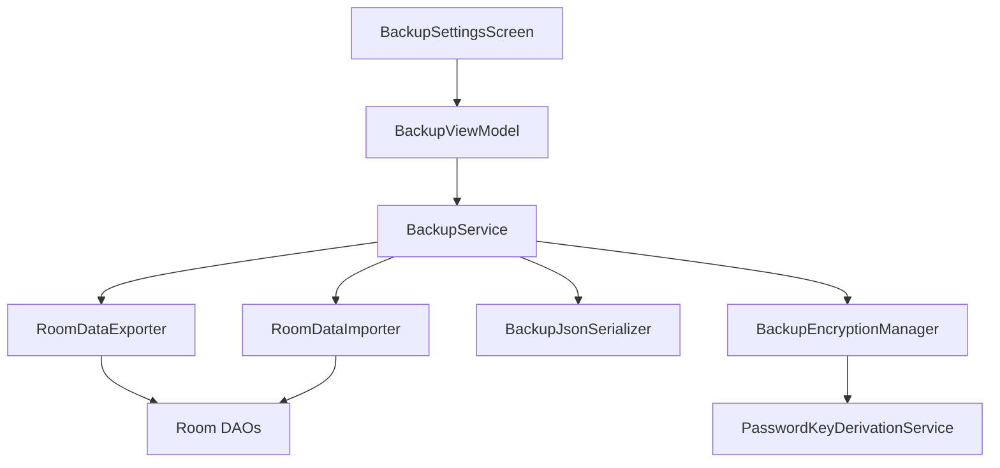
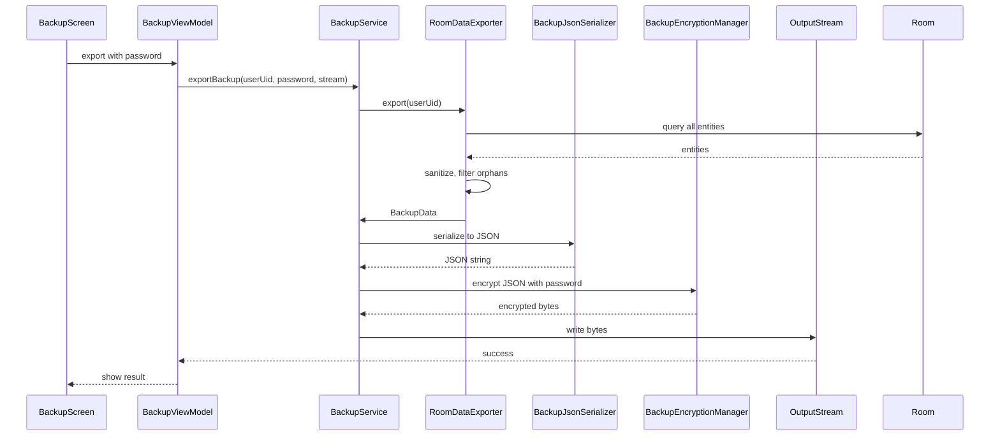
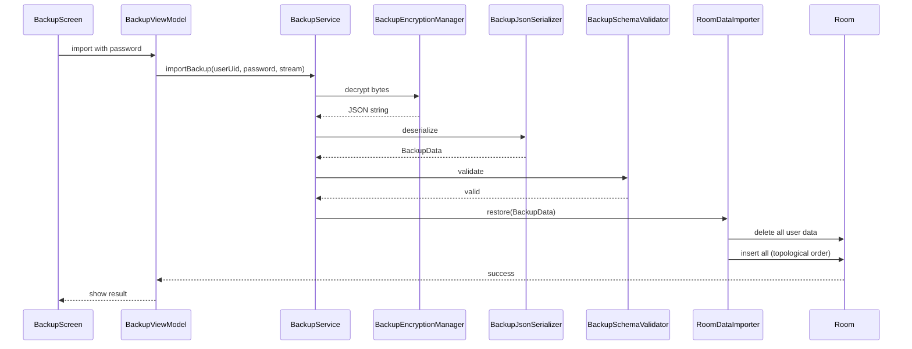

# Módulo Backup v1.0

**Fecha:** 15 de agosto de 2026  
**Versión:** 1.0

---

# Purpose

El módulo Backup permite a los usuarios exportar e importar una copia completa de sus datos financieros de forma cifrada. Resuelve el problema de portabilidad y recuperación: el usuario puede mover sus datos entre dispositivos o recuperarlos sin depender exclusivamente de Firebase.

---

# Responsibilities

- Exportar todas las entidades de Room a un archivo JSON cifrado.
- Cifrar el respaldo con una contraseña usando PBKDF2 + AES-256-GCM.
- Descifrar e importar un respaldo existente.
- Validar esquema y referencias del respaldo.
- Sanitizar entidades huérfanas durante exportación e importación.
- Mapear el `userUid` del respaldo al usuario actual.

---

# Functional Overview

El usuario puede:
- Acceder a Backup desde Settings.
- Crear una contraseña para cifrar el respaldo.
- Exportar el archivo a almacenamiento externo o compartirlo.
- Seleccionar un archivo de respaldo e importarlo.
- Restaurar todos sus datos en la misma cuenta o en otra.

---

# Architecture

---

# Main Components

- **BackupSettingsScreen.kt**: UI de exportación e importación.
- **BackupViewModel.kt**: Orquesta operaciones y estados.
- **BackupService.kt** / **BackupServiceImpl.kt**: Punto de entrada del dominio de backup.
- **RoomDataExporter.kt**: Construye `BackupData` desde Room.
- **RoomDataImporter.kt**: Restaura datos desde `BackupData` a Room.
- **BackupJsonSerializer.kt**: Serializa `BackupData` a/desde JSON.
- **BackupEncryptionManager.kt**: Cifra y descifra el contenido.
- **BackupSchemaValidator.kt**: Valida integridad del respaldo.
- **BackupFileManager.kt**: Maneja selección de archivos vía Storage Access Framework.

---

# Data Flow

### Export

### Import

---

# Dependencies

**Incoming:**
- Llamado desde Settings o PrivacyAndData.

**Outgoing:**
- Todos los DAOs para exportación e importación.
- `BackupEncryptionManager` para cifrado.
- `BackupFileManager` para SAF.

**Shared Components:**
- `SettingsSection`, `SettingsRow`.

---

# Design Decisions

- **Respaldo como JSON cifrado:** Portabilidad y legibilidad sin comprometer seguridad.
- **Reemplazo completo en import:** Estrategia `REPLACE_ALL` para evitar conflictos y mantener consistencia referencial.
- **Orden topológico:** Inserción de entidades en orden de dependencias para respetar FKs.
- **Cifrado por contraseña:** Independiente del dispositivo, permite restaurar en cualquier lugar.

*Inferencia arquitectónica:* La estrategia de reemplazo completo simplifica drásticamente la lógica de merge, a costa de perder cambios locales no respaldados. Es aceptable para una operación explícita de restauración.

---

# Risks

- Contraseña olvidada implica pérdida permanente del respaldo.
- Archivos corruptos o manipulados pueden causar fallos de validación.
- Restauración de grandes volúmenes de datos consume memoria.
- El usuario puede importar un respaldo de otro usuario si no se valida correctamente el mapeo de `userUid`.

---

# Technical Debt

- Conversión de `CharArray` a `String` para la contraseña en algún punto del flujo.
- `BackupViewModel` conoce demasiados detalles de gestión de archivos.
- No hay pruebas automatizadas de integridad de respaldo.

---

# Future Improvements

- Implementar backup incremental.
- Permitir respaldo en la nube propia (Drive, Dropbox) mediante sharesheet.
- Añadir pruebas de cifrado y restauración.
- Reducir uso de memoria en respaldos grandes mediante streaming.

## Module Health

| Dimension | Score |
|-----------|-------|
| Architecture Quality | 4/5 |
| Documentation Quality | 4/5 |
| Complexity | 3/5 |
| Test Coverage | 1/5 |
| Technical Debt | 2/5 |
| Risk Level | Med |
| Refactor Recommended | No |
| Last Reviewed | 2026-08-15 |
| Next Review | 2026-11-15 |

## Related Documents

- [Master Architecture v1.0](Master%20Architecture%20v1.0.md)
- [Glossary](../00_Project/Glossary.md)
- [Module Dashboard](Module%20Dashboard.md)
- [ADR-006 Backup Encryption](../04_Decisions/ADR-006%20Backup%20Encryption.md)
- [Xpendz Design System v1.0](../02_DesignSystem/Xpendz%20Design%20System%20v1.0.md)
