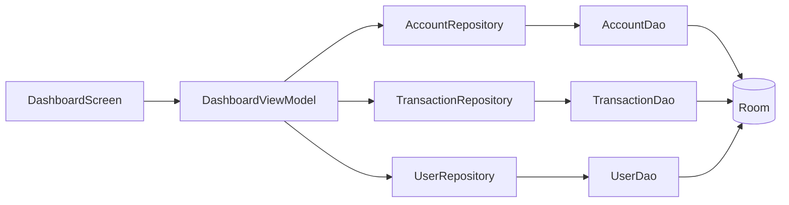
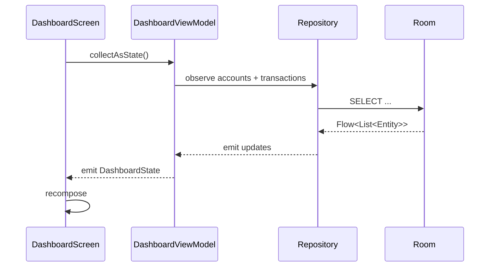

# Módulo Dashboard v1.0

**Fecha:** 15 de agosto de 2026  
**Versión:** 1.0

---

# Purpose

El módulo Dashboard es la pantalla principal de Xpendz. Su propósito es ofrecer una visión consolidada del estado financiero del usuario en un solo lugar: saldos, cuentas, resumen mensual y accesos rápidos a operaciones frecuentes.

Resuelve el problema de información dispersa: el usuario no necesita navegar a múltiples pantallas para ver su situación financiera actual.

---

# Responsibilities

- Mostrar el saldo total y el balance mensual.
- Listar las cuentas del usuario con sus balances.
- Mostrar ingresos, gastos y transferencias del mes.
- Permitir accesos rápidos: agregar transacción, transferencia, etc.
- Actualizar la UI en tiempo real ante cambios locales.
- Reflejar el estado de sincronización del usuario.

---

# Functional Overview

Desde el punto de vista del usuario, Dashboard es la primera vista tras iniciar sesión. En ella se observan:

- Un resumen superior con el saldo consolidado.
- Una lista de cuentas con iconos, colores y balances.
- Un resumen mensual con ingresos, gastos y diferencia.
- Botones de acción rápida para registrar movimientos.
- Un menú hamburguesa que permite navegar al resto de la app.

---

# Architecture

El módulo sigue el patrón MVVM:

---

# Main Components

- **DashboardScreen.kt**: Composable principal. Renderiza el estado del ViewModel.
- **DashboardViewModel.kt**: Mantiene el estado de la pantalla, agrega balances, expone flujos de cuentas y transacciones.
- **AccountCard.kt**: Componente reutilizable para mostrar una cuenta.
- **UserAccountHeader.kt**: Muestra información del usuario y estado de sincronización.
- **CompactHeader.kt**: App bar superior consistente.

---

# Data Flow

1. `DashboardViewModel` se inicializa y carga el usuario, cuentas y transacciones.
2. Los repositorios observan Room mediante `Flow`.
3. Cada cambio en la base de datos local se propaga automáticamente.
4. El ViewModel combina los flujos en un `DashboardState`.
5. El Screen recolecta el estado y se recomponen.

---

# Dependencies

**Incoming:**
- Navegación desde Login y Onboarding.
- Accesos desde bottom nav.

**Outgoing:**
- `AccountRepository`
- `TransactionRepository`
- `UserRepository`
- `SyncViewModel` (compartido)

**Shared Components:**
- `CompactHeader`, `AccountCard`, `UserAccountHeader`, `HamburgerMenu`.

---

# Design Decisions

- **Observación reactiva con Flow:** Evita consultas manuales y mantiene la UI siempre actualizada.
- **Estado inmutable con StateFlow:** Facilita razonar sobre cambios y prevenir mutaciones directas.
- **UserAccountHeader compartido:** Reutiliza la misma estructura en Settings para coherencia.

*Inferencia arquitectónica:* La pantalla principal debe ser inmediata y predecible; por eso todos sus datos provienen de Room local y no de Firestore.

---

# Risks

- `DashboardViewModel` puede crecer si se agregan análisis complejos.
- El cálculo de balances depende de consistencia de `TransactionRepository`.
- Cambios en `AccountDao.computeBalanceCents()` afectan directamente el resumen.

---

# Technical Debt

- Acumulación de lógica de agregación en `DashboardViewModel`.
- Posible duplicación de cálculo de ingresos/gastos con `TransactionsViewModel`.

---

# Future Improvements

- Mover cálculos agregados a UseCases o al dominio.
- Cachear resúmenes mensuales para mejorar rendimiento.
