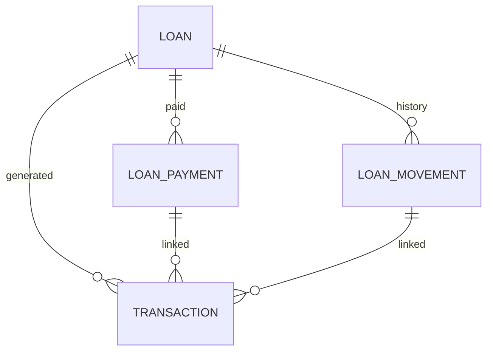
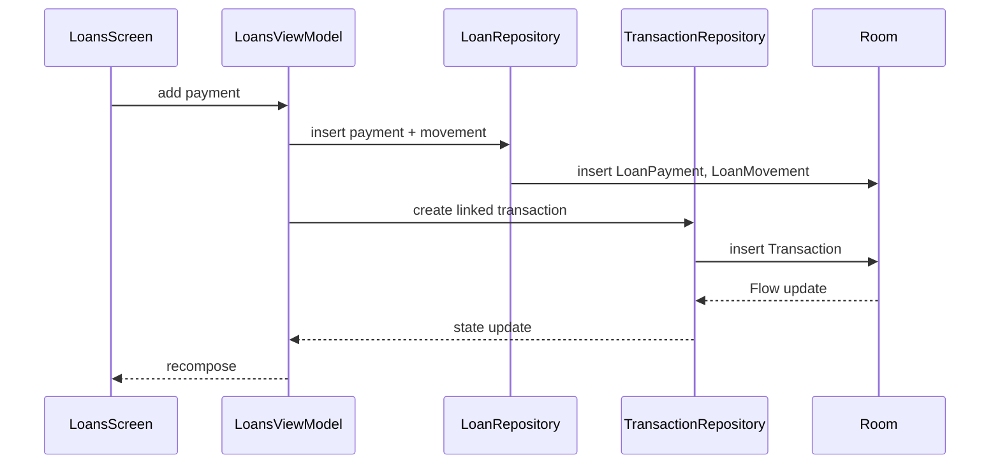

# Módulo Loans v1.0

**Fecha:** 15 de agosto de 2026  
**Versión:** 1.0

---

# Purpose

El módulo Loans permite al usuario registrar y seguir préstamos otorgados (`LENT`) y recibidos (`BORROWED`). Resuelve el problema de controlar deudas informales que, de otro modo, se perderían o confundirían con transacciones normales.

---

# Responsibilities

- Registrar préstamos con contraparte, monto principal, moneda y cuenta asociada.
- Registrar pagos y recargos (topups) de un préstamo.
- Calcular saldo restante y estado (`OPEN`/`CLOSED`).
- Crear transacciones vinculadas automáticamente para movimientos de dinero.
- Sincronizar préstamos, pagos y movimientos con Firestore.
- Generar historial de movimientos para auditoría.

---

# Functional Overview

El usuario puede:
- Ver una lista de préstamos activos e históricos.
- Crear un préstamo nuevo con contraparte y monto.
- Registrar un pago parcial o total.
- Registrar un recargo (topup) si el monto del préstamo aumenta.
- Ver el saldo pendiente y el historial de movimientos.
- Cerrar un préstamo cuando se salda.

---

# Architecture

El módulo Loans es uno de los más complejos. Utiliza tres entidades relacionadas:
- **LoanEntity**: representación del préstamo.
- **LoanPaymentEntity**: pagos recibidos o entregados.
- **LoanMovementEntity**: auditoría de movimientos (creación, pago, recargo, ajuste, cierre).

---

# Main Components

- **LoansScreen.kt**: Pantalla principal con tabs y lista de préstamos.
- **LoansViewModel.kt**: Lógica de estados, cálculo de saldo y operaciones.
- **LoanCard.kt**: Componente visual de un préstamo.
- **MovementItem.kt**: Item de historial de movimientos.
- **LoanModernTextField.kt**: Input reutilizable del módulo.
- **LoansSummaryCard.kt**: Resumen de totales por tipo.

---

# Data Flow

1. El usuario crea un préstamo.
2. `LoansViewModel` valida montos y cuentas.
3. `LoanRepository` inserta `LoanEntity` y `LoanMovementEntity`.
4. Si el préstamo genera movimiento de dinero, se crea una `TransactionEntity`.
5. Los cambios se propagan por `Flow` hacia la UI.
6. Cada operación local se sincroniza con Firestore.

---

# Dependencies

**Incoming:**
- Dashboard, menú hamburguesa, bottom nav.

**Outgoing:**
- `LoanRepository`
- `LoanPaymentRepository`
- `LoanMovementRepository`
- `TransactionRepository`
- `AccountRepository`
- `CategoryRepository` (para categorías de préstamo)

**Shared Components:**
- `CompactHeader`, `LoanCard`, `SectionHeader`.

---

# Design Decisions

- **Tres entidades separadas:** Distingue el préstamo, los pagos y el historial de auditoría. Aísla el cálculo del balance del registro contable.
- **Transacciones vinculadas:** Cada movimiento de dinero también es una transacción, manteniendo coherencia contable con el resto del sistema.
- **Categorías de sistema:** El módulo depende de categorías especiales (`Préstamos`, `Devoluciones`) gestionadas por `CategoryRepository`.

*Inferencia arquitectónica:* La separación entre `LoanPayment` y `LoanMovement` permite auditoría sin alterar el cálculo financiero, separando hecho contable de evento histórico.

---

# Risks

- Alta complejidad de sincronización: tres colecciones en Firestore.
- Riesgo de inconsistencias si una transacción vinculada se elimina.
- Lógica de status recalculation sensible a cambios en pagos.
- Doble clic en botones de pago requiere protección (documentado en `docs/LOANS_DOUBLE_CLICK_PROTECTION.md`).

---

# Technical Debt

- `LoansScreen.kt` es extenso; contiene diálogos, tabs, lista y gráficos.
- Lógica de negocio de préstamos distribuida entre `LoansViewModel` y `LoanRepository`.
- Uso de `Color.White` hardcodeado en algunos elementos.

---

# Future Improvements

- Extraer lógica de cálculo de saldo a un UseCase.
- Dividir `LoansScreen.kt` en subcomponentes.
- Automatizar creación de transacciones vinculadas mediante triggers en Repository.

## Module Health

| Dimension | Score |
|-----------|-------|
| Architecture Quality | 3/5 |
| Documentation Quality | 4/5 |
| Complexity | 5/5 |
| Test Coverage | 1/5 |
| Technical Debt | 4/5 |
| Risk Level | High |
| Refactor Recommended | Yes |
| Last Reviewed | 2026-08-15 |
| Next Review | 2026-09-15 |

## Related Documents

- [Master Architecture v1.0](Master%20Architecture%20v1.0.md)
- [Glossary](../00_Project/Glossary.md)
- [Module Dashboard](Module%20Dashboard.md)
- [ADR-002 Room and Firebase Offline-First](../04_Decisions/ADR-002%20Room%20and%20Firebase%20Offline-First.md)
- [LOANS_DOUBLE_CLICK_PROTECTION.md](../LOANS_DOUBLE_CLICK_PROTECTION.md)
