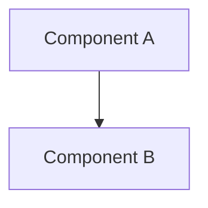

# Template - Architecture Document

**Fecha:** YYYY-MM-DD  
**Versión:** 1.0  
**Estado:** Draft

---

# Overview

Brief description of the architectural area.

# Purpose

Why does this area exist? What problem does it solve?

# Scope

What is included and excluded.

# Architecture

High-level explanation with diagrams.

# Main Components

List the key components and their responsibilities.

| Component | Responsibility |
|-----------|----------------|
| Component A | ... |

# Data Flow

Explain how information moves.

# Design Decisions

Document key decisions. Use "Inferencia arquitectónica" when necessary.

# Risks

What could break or complicate changes?

# Technical Debt

Known issues, if any.

# Future Improvements

Recommended next steps.

# Related Documents

- [Master Architecture](../03_Architecture/Master%20Architecture%20v1.0.md)
