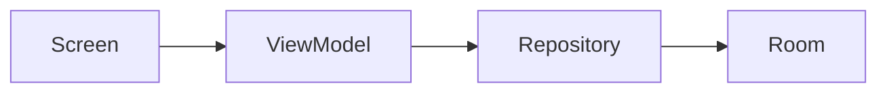

# Template - Module Document

**Fecha:** YYYY-MM-DD  
**Versión:** 1.0  
**Estado:** Draft

---

# Purpose

Why does this module exist? What business problem does it solve?

# Responsibilities

What is this module responsible for?

# Functional Overview

How does the module behave from the user's perspective?

# Architecture

Internal architecture and components.

# Main Components

Important classes or composables.

# Data Flow

How information moves through the module.

# Dependencies

| Type | Dependencies |
|------|--------------|
| Incoming | ... |
| Outgoing | ... |
| Shared | ... |

# Design Decisions

Why this architecture was chosen. Use "Inferencia arquitectónica" if needed.

# Risks

What requires special attention?

# Technical Debt

Observations, not solutions.

# Future Improvements

Concrete improvement opportunities.

# Module Health

| Dimension | Score |
|-----------|-------|
| Architecture Quality | /5 |
| Documentation Quality | /5 |
| Complexity | /5 |
| Test Coverage | /5 |
| Technical Debt | /5 |
| Risk Level | Low/Med/High |
| Refactor Recommended | Yes/No |
| Last Reviewed | YYYY-MM-DD |
| Next Review | YYYY-MM-DD |

# Related Documents

- [Master Architecture](../03_Architecture/Master%20Architecture%20v1.0.md)
